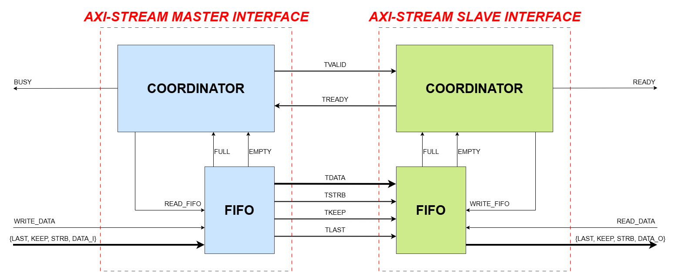

# AXI4-Stream HDL Implementation

This project provides a Verilog implementation of the **AXI4-Stream** protocol. It is designed with a modular structure, supports flexible parameterization, and includes internal FIFO buffers for efficient data stream management.

## 1. Architectural Overview
The system is designed to operate in one of two modes based on the configuration parameter:
* **Master Interface (`SELECT_INTERFACE = 0`)**: Receives data from the user side, passes it through a DFF register stage, stores it in a FIFO, and performs handshaking to push the data onto the AXI-Stream bus.
* **Slave Interface (`SELECT_INTERFACE = 1`)**: Receives data from the AXI-Stream bus, stores it in an internal FIFO, and provides a readiness signal for the user side to consume the data.

The core architecture consists of the **Coordinator** block, which handles handshake logic (Valid/Ready), and the **FIFO** block, which manages the storage of data and control signals (`TLAST`, `TKEEP`, `TSTRB`).



## 2. Configuration Parameters
The `axi4_stream` module can be customized through the following parameters:

| Parameter | Description | Default Value |
| :--- | :--- | :--- |
| `DATA_WIDTH_BYTE` | Data width in bytes (e.g., 2 = 16-bit) | 2 |
| `SELECT_INTERFACE` | Mode selection (0: Master, 1: Slave) | 0 |
| `SIZE_FIFO` | FIFO depth (Capacity = $2^{SIZE\_FIFO}$) | 8 |

## 3. Signal Descriptions

### System Signals
* `aclk_i`: System clock.
* `aresetn_i`: System reset (active-low).

### AXI4-Stream Interface (Master/Slave)
* `tvalid`, `tready`: Communication handshake signals.
* `tdata`, `tstrb`, `tkeep`, `tlast`: Main data bus and packet control signals.

### User Interface
* **Master Side**: 
    * `user_m_wr_data_i`: Write command into the Master FIFO.
    * `user_m_busy_o`: Signals that the FIFO is full or busy.
* **Slave Side**:
    * `user_s_rd_data_i`: Read command from the Slave FIFO.
    * `user_s_ready_o`: Signals that data is available in the FIFO.

## 4. Testing and Simulation
The testbench `tb_axi4_stream.v` integrates six comprehensive test scenarios:
1. **Single Transfer**: Tests a single data sample transmission.
2. **Burst Transfer**: Tests continuous data packet transmission with `TLAST`.
3. **Full FIFO**: Checks the backpressure mechanism when the buffer is full.
4. **Simultaneous R/W**: Tests simultaneous read and write operations.
5. **Continuous Master**: Tests sustained data loading from the user side.
6. **Max Throughput**: Tests maximum bandwidth utilization at full capacity.

## 5. Module Instantiation

### Master Interface Mode (SELECT_INTERFACE = 0)
Use this configuration to generate an AXI-Stream flow from your internal logic.
```verilog
axi4_stream #(
    .DATA_WIDTH_BYTE(2),  // 16-bit data width
    .SELECT_INTERFACE(0), // Configure as Master
    .SIZE_FIFO(8)         // 256-deep FIFO
) u_axis_master (
    .aclk_i(clk),
    .aresetn_i(reset_n),
    // AXI-Stream Master Interface
    .m_tvalid_o(m_axis_tvalid),
    .m_tready_i(m_axis_tready),
    .m_tdata_o(m_axis_tdata),
    .m_tstrb_o(m_axis_tstrb),
    .m_tkeep_o(m_axis_tkeep),
    .m_tlast_o(m_axis_tlast),
    // User Side Interface
    .user_m_busy_o(master_busy),
    .user_m_wr_data_i(user_wr_en),
    .user_m_data_i(user_data_in),
    .user_m_tstrb_i(2'b11),
    .user_m_tkeep_i(2'b11),
    .user_m_tlast_i(user_last_in)
);
```


### Slave Interface Mode (SELECT_INTERFACE = 1)
Use this configuration to consume data from an external AXI-Stream source.

```verilog
axi4_stream #(
    .DATA_WIDTH_BYTE(2),  // 16-bit data width
    .SELECT_INTERFACE(1), // Configure as Slave
    .SIZE_FIFO(8)         // 256-deep FIFO
) u_axis_slave (
    .aclk_i(clk),
    .aresetn_i(reset_n),
    // AXI-Stream Slave Interface
    .s_tvalid_i(s_axis_tvalid),
    .s_tready_o(s_axis_tready),
    .s_tdata_i(s_axis_tdata),
    .s_tstrb_i(s_axis_tstrb),
    .s_tkeep_i(s_axis_tkeep),
    .s_tlast_i(s_axis_tlast),
    // User Side Interface
    .user_s_ready_o(data_ready),
    .user_s_rd_data_i(user_rd_en),
    .user_s_data_o(user_data_out),
    .user_s_tstrb_o(user_strb_out),
    .user_s_tkeep_o(user_keep_out),
    .user_s_tlast_o(user_last_out)
);
```

## 6. Directory Structure
* `/sources_1/new/`: Contains primary HDL source code (`axi4_stream.v`, `fifo_unit.v`, etc.).
* `/sim_1/new/`: Contains testbench source code (`tb_axi4_stream.v`).
* `/doc/`: Contains the design architecture diagram (`AXI4-Stream.drawio.png`).

---
*Project maintained by Raven1911.*